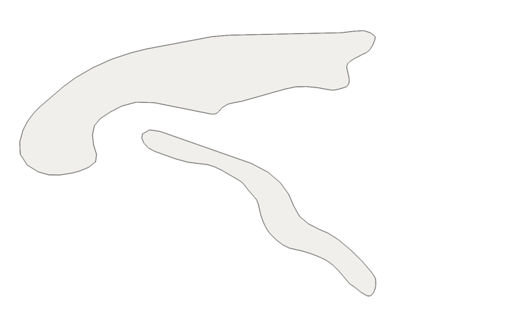

=================
label_centerlines
=================

This tool runs with Python 3.6 and reads Polygon/MultiPolygon datasets such as
i.e. the `geographic regions`_ from `Natural Earth`_ and extracts smoothed
centerlines for better label placement. This method is used to create the label
layer of `EOX Maps`_.

.. _`geographic regions`: http://www.naturalearthdata.com/http//www.naturalearthdata.com/download/10m/physical/ne_10m_geography_regions_polys.zip
.. _`Natural Earth`: http://www.naturalearthdata.com/
.. _`EOX Maps`: http://maps.eox.at

To do so, it a `Voronoi diagram`_ is created to get the polygon skeleton where
the skeleton centerline is selected and smoothed.

.. _`Voronoi diagram`: https://en.wikipedia.org/wiki/Voronoi_diagram

Steps:

1. Extract outline.
2. Segmentize outline to get more evenly distributed outline points.
3. Extract points.
4. If there are too many points, simplify the segmentized outline and Extract
   points again.
5. Create Voronoi diagram.
6. Select all Voronoi edges which are inside the source polygon.
7. Determine the best line.
8. Smooth line.

------------
Installation
------------

clone repository and run

.. code-block:: shell

    pip install -r requirements.txt
    python setup.py install

---
CLI
---

.. code-block:: shell

    $ label_centerlines --help

    Usage: label_centerlines [OPTIONS] INPUT_PATH OUTPUT_PATH

      Read features, convert to centerlines and write to output.

      Multipart features (MultiPolygons) from input will be converted to
      singlepart features, i.e. all output features written will be LineString
      geometries, not MultiLineString geometries.

    Options:
      --version                       Show the version and exit.
      --segmentize_maxlen FLOAT       Maximum segment length for polygon borders.
                                      (default: 0.5)
      --max_points INTEGER            Number of points per geometry allowed before
                                      simplifying. (default: 3000)
      --simplification FLOAT          Simplification threshold. (default: 0.05)
      --smooth INTEGER                Smoothness of the output centerlines.
                                      (default: 5)
      --max_paths INTEGER             Number of longest paths used to create the centerlines.
                                      (default: 5)
      --output_driver [GeoJSON|GPKG]  Output format. (default: 'GeoJSON')
      --verbose                       show information on processed features
      --debug                         show debug log messages
      --help                          Show this message and exit.

---
API
---

.. code-block::

    >>> from label_centerlines import get_centerline
    >>> help(get_centerline)

    get_centerline(geom, segmentize_maxlen=0.5, max_points=3000, simplification=0.05, smooth_sigma=5, max_paths=5)
    Return centerline from geometry.

    Parameters:
    -----------
    geom : shapely Polygon or MultiPolygon
    segmentize_maxlen : Maximum segment length for polygon borders.
        (default: 0.5)
    max_points : Number of points per geometry allowed before simplifying.
        (default: 3000)
    simplification : Simplification threshold.
        (default: 0.05)
    smooth_sigma : Smoothness of the output centerlines.
        (default: 5)
    max_paths : Number of longest paths used to create the centerlines.
        (default: 5)

    Returns:
    --------
    geometry : LineString or MultiLineString

    Raises:
    -------
    CenterlineError : if centerline cannot be extracted from Polygon
    TypeError : if input geometry is not Polygon or MultiPolygon

-------
License
-------

MIT License

Copyright (c) 2015, 2016, 2017, 2018 `EOX IT Services`_

.. _`EOX IT Services`: https://eox.at/

(see LICENSE file for more details)
